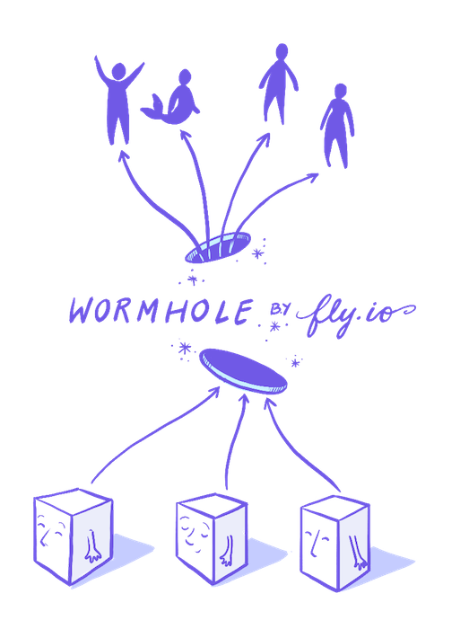

# wormhole - Fly.io reverse Proxy

## What is wormhole?
Wormhole is a reverse proxy that creates a secure tunnel between two endpoints.

## Compiling
**Wormhole requires Go1.7+**

    go get github.com/superfly/wormhole
    cd $GOPATH/src/github.com/superfly/wormhole
    make setup
    make binaries

## Running locally

    brew install redis

    # make sure redis-server is running

    # Start server
    ./scripts/wormhole-server.sh

    # Start clients (defaults to 1)
    ./scripts/wormhole-local.sh <NUM_CLIENTS>

    # The tunnel will be accessible on a randomly chosen port (look at wormhole-server logs):
    # [Feb 20 20:43:50]  INFO SSHHandler: Started session 29ff7b66abcc9871cdf1bc551f6e89728202f3e24e48675ecd9b8556a5dbd60b for Mats-MBP.local ([::1]:63169). Listening on: localhost:63170
